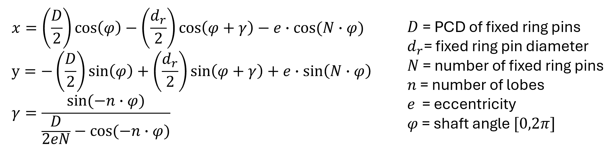
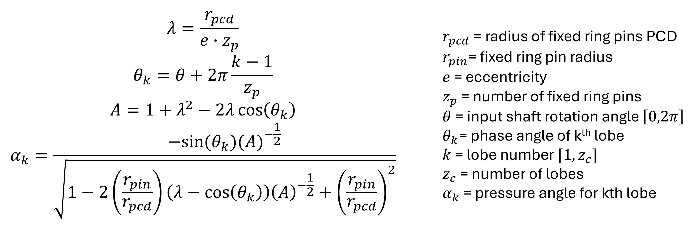
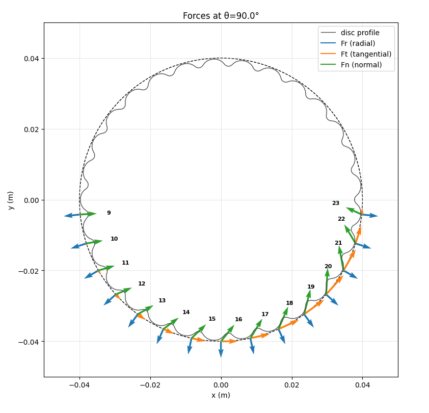
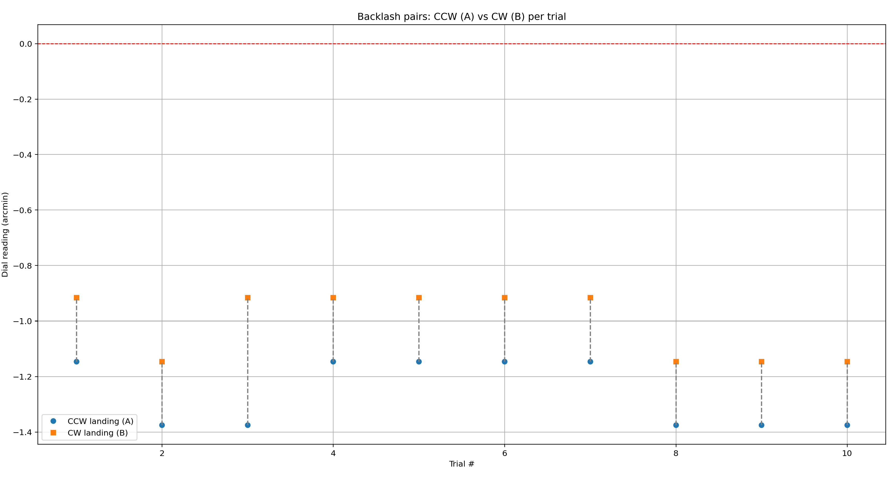
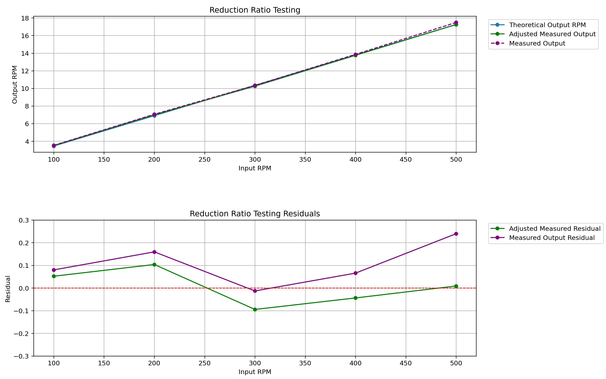

# Cycloidal Gearbox — Firmware (STM32 Nucleo) + Python Analysis

This repo contains two complementary parts:

1. **STM32 Nucleo firmware** to drive a stepper motor through my cycloidal reducer and run motion test routines (accuracy, repeatability, backlash, ratio).
2. **Python analysis tools** for my pre‑design calculations/visualization and post‑test data analysis.

It’s meant as a complete loop: **command motions → measure → analyze → iterate**.

---

## Repository structure

```
.
├─ CycloidGearbox/                 # Firmware (PlatformIO + STM32 HAL)
│  ├─ platformio.ini               # board/framework/upload settings
│  ├─ src/
│  │  ├─ main.c                    # main source code
│  │  ├─ loadcell_hal.c            # loac cell source code
│  │  └─ motor_hal.c               # source code for stepper motor functions
│  ├─ include/
│  │  ├─ main.h
│  │  ├─ loadcell_hal.h
│  │  └─ motor_hal.h
│  └─ lib/                         # reusable libs
│  └─ .pio/                        # build artifacts (ignored)
│
├─ PythonCode/
│  ├─ TestingAnalysis/             # post-testing analysis
│  │  ├─ AccuracyTesting.py        # absolute accuracy vs commanded angle
│  │  ├─ Backlash.py               # bidirectional backlash / lost-motion
│  │  ├─ RatioTesting.py           # speed/ratio comparisons
│  │  ├─ Repeatability.py          # same-direction landing repeatability
│  │  └─ ShaftTesting.py           # empirical shaft torsion testing
│  ├─ Archive/                     # semi-functional scripts
│  │  ├─ viz_attempt.py            # Misc viz utilities
│  │  └─ PA_viz.py                 # pre-design: profile/geometry visualization
│  ├─ FA.py                        # pre-design: force analysis tool
│  ├─ PAcompute_cf.py              # pre-design: pressure angle analysis - closed form
│  └─ profileGenerator.py          # pre-design: generate cycloidal profiles
│
├─ docs/                           # images/figures for README 
├─ Final_BOM.xlsx                  # Final BOM excel file for sourced parts 
└─ README.md

```


## Firmware overview (PlatformIO + STM32 Nucleo)

- Tooling: **PlatformIO** in VS Code
- File layout: sources in `CycloidGearbox/src/`, headers in `CycloidGearbox/include/`
- Direction convention used across code & analysis: **+angle = CCW**, **−angle = CW**.
- Key routines (in `motor_hal.c`):
  - `MoveByAngle(motor,motor_angle_rad, motor_rpm)` — speed ramping to specified motor RPM in the **motor-space**.
  - `MoveByAngleConst(motor, motor_angle_rad, motor_rpm)` — constant motor RPM at the **motor-space**.
  - `MoveOutputByDeg_FixedMotorRPM(motor, out_deg, motor_rpm)` — **output‑space** move by specified angle using the reduction.
  - `StepMotor(motor)` — ISR tick that updates step rate, pulses STEP, and stops when done.
  - **Test helpers** (used during measurements):
    - `Landing_FromCW(...)`, `Landing_FromCCW(...)` — retreat then re‑approach from a given side.
    - `RepeatabilityTest_OutputCW_FixedRPM(...)` — orchestrates multiple landings in same direction at constant motor RPM.
    - `BacklashTest_FixedRPM(...)` — orchestrates CW/CCW landings at a constant motor RPM.
- Safety / setup:
  - Mount the dial indicator **tangentially** to the arm’s path (perpendicular to radius).
  - Start **touching the probe**, dial **zeroed**, before running a landing routine.
  - Use a modest retreat (**2–3°**) and a constant, gentle **motor RPM**.

**Example** `platformio.ini`:
```bash
[env:nucleo_f446re]          // change to your exact board ID
platform = ststm32
board = nucleo_f446re        // e.g. nucleo_f401re, nucleo_l476rg, nucleo_g431rb
framework = stm32cube
monitor_speed = 9600
```

## Pre‑design analysis (`PythonCode/`)

These scripts help you size and analyze the cycloidal stage **before** building it. They live under `PythonCode/` (separate from `PythonCode/TestingAnalysis/` which is post‑testing).

### 1) Profile Generator — `profileGenerator.py`
**Function:** Generate cycloid **XY profile** & gearbox diagram for pre-CAD visualization.

- **Inputs:** Fixed Ring Pin Count (N), Fixed Ring Pin PCD (D), eccentricity (e), fixed ring pin diameter d<sub>r</sub>, shaft angle ($\gamma$).
- **Outputs:** static plot of cycloid profile centered at (0,0), static plot of gearbox diagram (with ring pins, output pins) in 2-disc configuration.
- **Parametric form:**
<p align="center">
  
</p>


### 2) Pressure Angle — Closed Form — `PAcompute_cf.py`
**Function:** Compute closed‑form expression for \(\alpha(\theta)\); what are its **max/min/RMS** values? <br>
**Definition:** The pressure angle is the angle between the contact force (normal) and the tangent to the motion, governing how efficiently force is transmitted through the gear teeth.
- **Inputs:** same geometry as `profileGenerator.py`.
- **Outputs:** 3 plots related to pressure angle analysis: 
    1. Pressure Angle vs. input rotation angle for any given lobe
    2. Instantaneous Multi-Tooth Average Pressure Angle - effective pressure angle at a given input rotation, considering **all simultaneously** engaged pins
    3. Pressure Angle vs. profile parameter - observe the effect of parameters (e, r<sub>pcd</sub>, etc) on Pressure Angle
- **Closed‑form formula for Pressure Angle at k<sup>th</sup> lobe:**
<p align="center">
  
</p>


### 3) Force Analysis — `FA.py`
**Function:** Compute contact forces shared across lobes/pins as the rotor turns? What are the peaks?

- **Inputs:** Input torque T<sub>in</sub>, shaft radius r<sub>shaft</sub>, eccentricity \(e\).
- **Outputs:**  
  1. Per-lobe force analysis (F<sub>r</sub>,F<sub>t</sub>,F<sub>n</sub>)
  2. Per-lobe stress analysis
  3. Per-disc Force distribution vs. shaft angle (i.e active lobes)
  4. Normal force heat map vs. shaft angle
  5. Force vector overlay on active lobes
- **Sample force vector overlay plot:**
<p align="center">
  
</p>

---


## Post-Testing Data Analysis (`TestingAnalysis/`)

These scripts help with post-testing data analysis to validate the gearbox design against the EDS. They live under `PythonCode/TestingAnalysis/`.

### Repeatability (`Repeatability.py`)
**Question:** How tightly do repeated landings cluster when approaching from the **same direction**?

- Input: one or more arrays of dial readings (mm) or pre‑converted arcminutes.
- Conversion (if using mm at radius `r_mm`):
  $\theta_{\text{arcmin}} = s_{\text{mm}}\cdot\frac{10800}{\pi\,r_{\text{mm}}}$
- Metrics reported (arcmin): **mean (bias)**, **σ (sample std, ddof=1)**, **MAE**, **RMSE**, **Max|err|**, **N**.
- Plots:
  - **Strip (dot) plot** per set with **mean ±1σ** (stacked duplicates, no random jitter).

### Backlash (`Backlash.py`)
**Question:** What’s the bidirectional **lost motion** at a target when approaching from CW vs CCW?

- Provide paired arrays `A` (CW landing) and `B` (CCW landing) in **mm** or **arcmin**.
- Signed difference: `d = A − B` (arcmin) → **directional bias** (which side lands deeper).
- Backlash magnitude: `|A − B|` (arcmin) → the spec number.
- Outputs:
  - Summary: mean / median / p95 / max of **|A−B|**.
  - Signed bias: **mean ± σ** of `d`.
  - Plots: paired A/B with **light‑grey connectors**; scatter of **|A−B|** per trial with mean line.
<p align="center">
  
</p>

### Accuracy (`AccuracyTesting.py`)
**Question:** How accurate is the output angle vs command (e.g., 1–5°)?

- Convert dial travel (mm) at radius `r_mm` → degrees:
  $\theta\;[^\circ] = \frac{s}{r}\cdot\frac{180}{\pi}$
- Fit measured vs commanded. Report:
  - **slope** (scale error), **intercept** (offset), **R²**,
  - **RMSE/MAE/Max|err|** (arcmin)
- Plots: **Measured vs Commanded** (with ideal `y=x`) and **residuals**.

### Ratio (`TestingAnalysis/RatioTesting.py`)
**Question:** How close is measured output speed to theoretical (input speed x output reduction)?

- Report % differences and **MAPE**.
<p align="center">
  
</p>


## Dial‑indicator setup notes

- Probe axis **tangential** to the arm motion (perpendicular to radius).
- Use the correct radius `r_mm` from shaft center to contact point.
- Typical retreat for landing tests: **2–3°** (at 150 mm ⇒ 5.2–7.9 mm travel).
- With a **0.01 mm** dial at **150 mm**, one tick = **0.229 arcmin** → measurements may be **resolution‑limited**.

---


## Acknowledgements

Thanks to open‑source STM32 HAL examples and the scientific Python ecosystem (NumPy, Pandas, Matplotlib).
