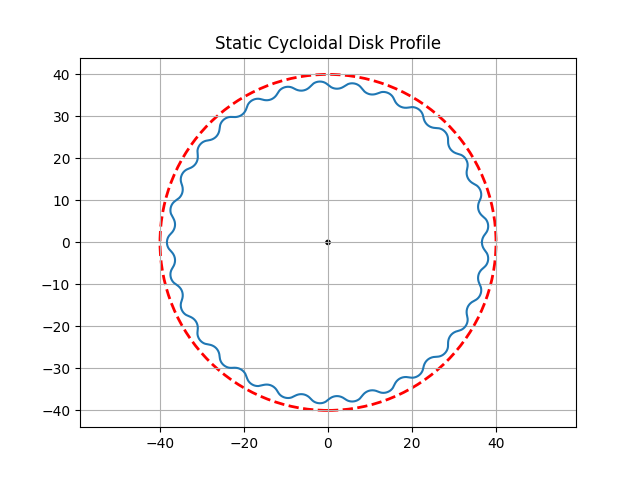
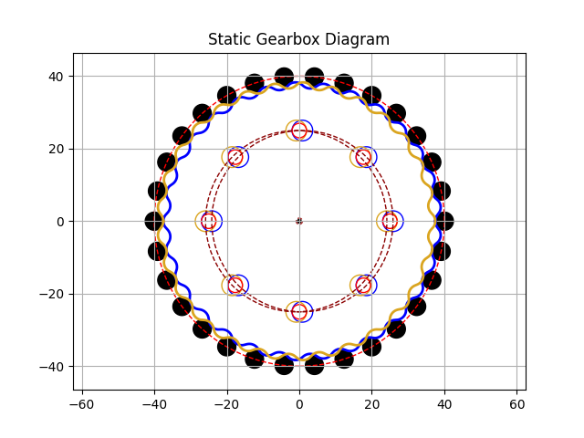

# CycloidalGearbox
The following repo contains code for profile generation of the cycloidal gearbox as well as design analysis of pressure angles of such profiles. 

profileGenerator.py generates 2 plots of the static cycloid disc profile. Figure 1 shows the profile generated based on set input parameters, with Figure 2 illustrating a sketch of the gearbox design (i.e with output pins & dual disc configuration)

